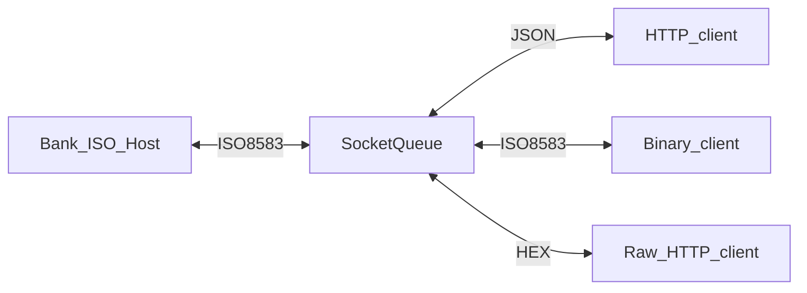

# SocketQueue

Free ISO 8583 gateway (bridge) for banking and fintech POS communication. Powered by [Node.js](https://nodejs.org/).

## Table of Contents

- [Overview](#overview)
- [Features](#features)
- [Requirements](#requirements)
- [Installation](#installation)
- [Basic Usage](#basic-usage)
- [Binary ISO 8583 Service](#binary-iso-8583-service)
- [HTTP JSON Service](#http-json-service)
- [Testing](#testing)
- [Collecting the Statistics](#collecting-the-statistics)
- [Compatibility](#compatibility)
- [Signals](#signals)
- [Demo Instance](#demo-instance)
- [Running on Docker](#running-on-docker)
- [Commercial Collaboration](#commercial-collaboration)
- [Reporting Bugs](#reporting-bugs)
- [License](#license)

## Overview

SocketQueue acts as a gateway between a bank ISO 8583 system and customer applications that need to talk to it. The service keeps one "host-to-host" connection with the bank processing host that is used to transfer data sent by multiple local clients in various representations. In POS processing systems, a "host-to-host" connection means all data is sent and received via a single full-duplex socket asynchronously.

The received data is assigned to the appropriate sender using the TID (Terminal Id) and STAN (System Trace Audit Number). If two clients send payment transactions using the same TID, the second packet is queued until the first one is processed or timed out. This is not a normal operation mode in terms of International Payment Systems, but some small fintech startups may have to accept it due to licensing restrictions from some acquiring banks.



## Features

**Core**

* Multiplexing connection manager
* Message queue with TID queueing (wait for busy TID)
* Auto-reversal implementation
* Solves SmartVista-specific transaction mishandling
* Lightweight, PCI-DSS friendly, reliable, event-based — hundreds of concurrent connections at a time
* Mitigates upstream disconnects caused by automated PCI-DSS port scanning

**Protocols**

* Host-to-Host on the left (one permanent TCP connection), Host-to-POS on the right (many TCP connections)
* Binary ISO 8583 and JSON over HTTP at the same time
* ISO 8583 validation and value padding
* Customizable ISO 8583 syntax (SmartVista, OpenWay)

**Operations**

* Safe data/events logger (console, files, LogStash)
* Stats Server (transaction amounts, MTI stats)

**Testing**

* Socket Bank (emulates the ISO host)
* Built-in test clients (self-test mode)
* Automated smoke test via `npm test`

## Requirements

* Node.js 18+ (tested on Node 20)
* npm

## Installation

Works on both Linux and Windows.

1. Install Node.js from https://nodejs.org/en/download/
2. Clone the repository:

```bash
git clone https://github.com/juks/iso-8583-socket-queue.git
cd iso-8583-socket-queue
```

3. Install dependencies:

```bash
npm install
```

4. Run the smoke test (optional):

```bash
npm test
```

SocketQueue is tested in production for months, processing thousands of transactions a day without crashes or memory leaks. For production deployments, consider running it under [Supervisor](https://github.com/Supervisor/supervisor).

Sample supervisor config:

```ini
[program:socketqueue]
command=node ./socketQueue.js --c=config.json
directory=/path/to/socketqueue
autostart=true
autorestart=true
startsecs=5
startretries=3
stopsignal=TERM
stopwaitsecs=10
```

## Basic Usage

To see all command-line and configuration file parameters:

```bash
node socketQueue.js --help
```

Connect to a remote ISO host at 10.0.0.1:5000 and listen for binary ISO 8583 clients on port 2014:

```bash
node socketQueue.js --upstreamHost=10.0.0.1 --upstreamPort=5000 --listenPort=2014
```

Add verbosity and log to a file:

```bash
node socketQueue.js --upstreamHost=10.0.0.1 --upstreamPort=5000 --listenPort=2014 --vv --logFile=log.txt
```

Suppress console output (logs still go to file):

```bash
node socketQueue.js --upstreamHost=10.0.0.1 --upstreamPort=5000 --listenPort=2014 --vv --logFile=log.txt --silent
```

When the upstream host connects to you instead (listen mode):

```bash
node socketQueue.js --upstreamListenPort=5000 --listenPort=2014 --vv
```

Store options in a configuration file:

```bash
node socketQueue.js --c=config.json
```

Example `config.json`:

```json
{
    "upstreamHost":    "10.0.0.1",
    "upstreamPort":    5000,
    "listenPort":      2014,
    "vv":              true,
    "logFile":         "log.txt"
}
```

## Binary ISO 8583 Service

SocketQueue relays POS transactions sent as ISO 8583 messages. Each valid message from a client is forwarded to the ISO host; each host response is sent back to the client. Use `--listenPort` to start the binary ISO 8583 gateway.

Each message consists of three parts: the MTI (Message Type Indicator), bitmap (lists the fields being sent), and field values. See the [ISO 8583 Wikipedia article](https://en.wikipedia.org/wiki/ISO_8583) for syntax details.

## HTTP JSON Service

SocketQueue accepts ISO 8583 transactions as JSON objects. Each valid message is converted to an ISO 8583 string (with padding where necessary), sent to the ISO host, and the response is converted back to JSON.

Start the HTTP server with `--listenHttpPort`:

```bash
node socketQueue.js --upstreamHost=10.0.0.1 --upstreamPort=5000 --listenHttpPort=8080 --vv --logFile=log.txt
```

**Endpoints**

| Method | Path | Content-Type | Description |
|--------|------|--------------|-------------|
| POST | `/` | `application/json` | ISO 8583 fields as JSON object |
| POST | `/raw` | `text/plain` | HEX-encoded ISO 8583 message |

> **Security note:** The HTTP API has no TLS or authentication. Use it only on trusted internal networks.

Test a purchase with EMV transaction data:

```bash
curl -H "Content-Type: application/json" -X POST -d '{ "0": "0200",  "3": "0",  "4": 1000,  "7": "0818160933",  "11": 618160,  "12": "150820130600",  "22": "056",  "24": "200",  "25": "00",  "35": "4850781234567891=19082012232800000037",  "41": 992468,  "42": 124642124643,  "49": "810",  "55": "9f2608571f1e10d4fa4aac9f2701809f100706010a03a4b8029f37045bb074729f3602000c950500800010009a031508189c0109f02060000000010005f2a02064382023c009f1a0206439f03060000000000009f3303e0f0c89f34034403029f3501229f1e0835313230323831358407a00000000310109f41030000565f340101" }' http://localhost:8080
```

Successful response:

```json
{
   "result":{
      "0": "0210",
      "1": "723005802ec08200",
      "2": "4850780000478123",
      "3": 0,
      "4": 1000,
      "7": "0820130546",
      "11": "618160",
      "12": "150820130600",
      "22": "056",
      "24": 200,
      "25": 0,
      "35": "4850781234567891=19082012232800000037",
      "37": "708981921851",
      "38": "VaHYUU",
      "39": 0,
      "41": "00992468",
      "42": "000124642124643",
      "49": 643,
      "55": "9f2608571f1e10d4fa4aac9f2701809f100706010a03a4b8029f37045bb074729f3602000c950500800010009a031508189c0109f02060000000010005f2a02064382023c009f1a0206439f03060000000000009f3303e0f0c89f34034403029f3501229f1e0835313230323831358407a00000000310109f41030000565f340101"
   },
   "errors":[]
}
```

With verbose logging enabled, a purchase request produces output similar to:

```
2015-08-31 18:22:57 - info: Client http:127.0.0.1:53578 connected
2015-08-31 18:22:57 - info: Client http:127.0.0.1:53578 sent data
     [Purchase Request]
     Message Type Indicator [0].......................0200
     Amount, Transaction [4]..........................1000
     ...
2015-08-31 18:22:57 - info: Upstreaming data for http:127.0.0.1:53578
2015-08-31 18:22:57 - info: Got data from ISO-host (306b)
     [Purchase Response]
     Message Type Indicator [0].......................0210
     Response code [39]...............................0 (Successful Transaction)
```

Send a HEX-encoded message via `/raw`. For this ISO 8583 payload:

```
08002220010000800000990000083020354500000183100000001
```

Use:

```bash
curl -H "Content-Type: text/plain" -X POST -d '303830302220010000c00000303030303030303630373136313730303132333435363030303030313233343536313233353637383930313234353637' http://localhost:8080/raw
```

## Testing

### Automated smoke test

`npm test` runs an end-to-end check: gateway + echo server + 5 test clients, waiting for 50 successful echo responses. Implemented in [`test/smoke.js`](test/smoke.js).

```bash
npm test
```

### Manual self-test

Use `--echoServerPort` to run a local ISO host emulator (supports MTI 800 echo, 200 purchase, and 400 reversal). Add `--testClients` with `--testTargetHost` and `--testTargetPort` to emulate client connections.

**Run upstream and echo server in one process:**

```bash
node socketQueue.js --upstreamHost=localhost --upstreamPort=5000 --listenPort=2014 --vv --echoServerPort=5000
```

**All-in-one: gateway, echo server, and 5 test clients:**

```bash
node socketQueue.js \
  --upstreamHost=localhost --upstreamPort=5000 \
  --listenPort=2014 --echoServerPort=5000 \
  --testTargetHost=localhost --testTargetPort=2014 \
  --testClients=5 --vv
```

**Separate process — emulate 10 clients** (gateway must already be running):

```bash
node socketQueue.js --testTargetHost=localhost --testTargetPort=2014 --testClients=10 --vv
```

**Echo server only** (with Socket Bank):

```bash
node socketQueue.js --vv --echoServerPort=5000
```

## Collecting the Statistics

The `--statServerPort` option enables the statistics module on the given port. It collects the following while SocketQueue processes ISO 8583 transactions:

| Parameter | Meaning |
|-----------|---------|
| `securedAmount` | Successful transactions amount minus refund and reversal amount |
| `processedAmount` | Total transactions amount, including failed transactions |
| `refundAmount` | Total amount of refund transactions |
| `reversalAmount` | Total amount of reversal transactions |
| `faultStat` | Error code statistics |
| `packetCount` | Packet count, total and by each MTI type |

If the stats server runs on port 4000:

```bash
curl localhost:4000
```

Example response:

```javascript
{
   "securedAmount":1383554.49,
   "processedAmount":1876911.69,
   "refundAmount":0,
   "reversalAmount":3460,
   "faultStat":{
      "5": 2,
      "100": 7,
      "103": 1,
      "116": 3,
      "117": 1,
      "120": 10
   },
   "packetCount":{
      "total": 2265,
      "0800": 730,
      "0810": 724,
      "0200": 367,
      "0210": 364,
      "0400": 48,
      "0410": 32
   }
}
```

Suitable for integration with Zabbix, Kibana, or other monitoring tools.

## Compatibility

SocketQueue is designed to work with SmartVista and OpenWay processing systems.

## Signals

SocketQueue handles TERM, INT, and HUP signals correctly. It gracefully quits on TERM/INT and resets stats / reopens the log file on HUP.

"Graceful quit" means that before exiting:

* no new connections from POS clients are accepted
* active transaction responses are delivered
* pending auto-reversal requests (if enabled) are performed

To force termination at any time, send a KILL signal.

## Demo Instance

> **Note:** Availability of the public demo is not guaranteed.

A public demo instance may be available at:

* `askarov.com:12345` — raw upstream
* `askarov.com:12346` — HTTP JSON upstream

Raw mode:

```bash
cat ./sample_payloads/sv_800_echo.txt | nc askarov.com 12345
```

HTTP JSON:

```bash
curl -H "Content-Type: application/json" -X POST -d '{ "0": "800", "3": "0", "7": "0607161700", "11": "123456", "24": "0", "41": "00123456", "42": "123567890124567" }' http://askarov.com:12346
```

## Running on Docker

> **Note:** The Docker image uses Node.js 8 (legacy). For production, prefer running directly on Node.js 20 LTS.

### Config

The repository includes [`sample-config.json`](sample-config.json) preconfigured for Docker Compose (`upstreamHost` points to the `echo-server` service).

### Build image

```bash
docker build -t socket-queue:latest .
```

### Run standalone

```bash
docker run -v $(pwd)/sample-config.json:/etc/socket-queue/config.json -t socket-queue:latest --c=/etc/socket-queue/config.json
```

### Docker Compose

Starts three services:

1. **socket-queue** — gateway listening on port 2014, upstream to echo-server
2. **echo-server** — ISO host emulator on port 5000
3. **test-client** — 10 emulated clients connecting to `socket-queue:2014`

```bash
docker-compose up
```

The `test-client` service connects to the `socket-queue` container by hostname, not `localhost`.

## Commercial Collaboration

For commercial inquiries (payment systems integration, POS Android/iOS development, and other payment solutions), contact juks@juks.ru.

## Reporting Bugs

Please report bugs in the GitHub issue tracker: https://github.com/juks/iso-8583-socket-queue/issues

## License

Copyright (c) 2015–2026 Igor Askarov (juks@juks.ru). See the License file for details.
